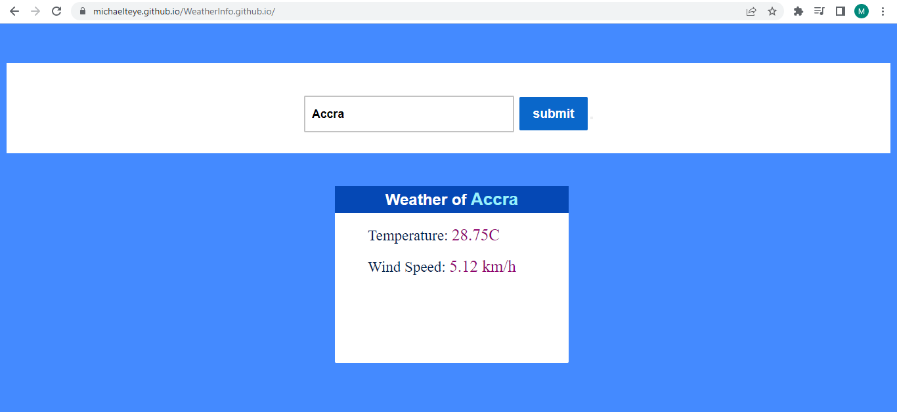

# Weather Project-2022: 
In this project I created a simple weather application that help find out the weather of any location by providing both the Temperature and Wind Speed of the location 

Website Link: [Click To Access Site](https://michaelteye.github.io/WeatherInfo.github.io/)

# How It's Made:
### Tech Used: HTML, CSS, JavaScript

In this project made here, you will be able to know the temperature,wind speed, sky condition. First l created a box that contains an input box. If you input the name of any city in the input box, you will get all the information.

You will see all the information in another box.With the help of this ***simple weather application***, you can easily know the weather of any city in the world.

# Lessons Learned:
Building this project exposed me to how I could work and interact with APIs and other frontend application to create a Web Application that could solve a problem.